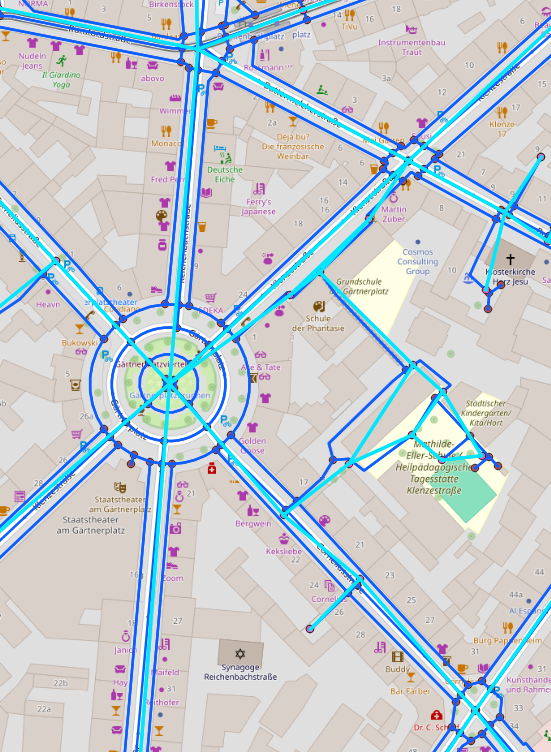
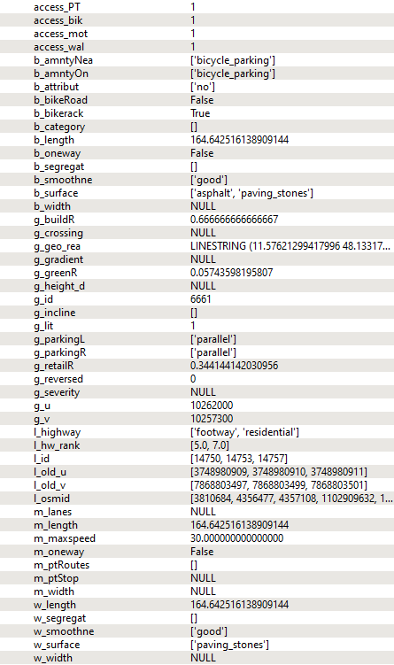

# OSMTopoMerge

## Overview

**OSMTopoMerge**: A topologically simplified OSM network, enriched with additional (open) data sources - designed to provide a streamlined, multimodal network. A.k.a. **OSM.STEM**: Simplified topology, enriched, multimodal.

- Idea
- Input data
- How to
- Methodology
- Tags / Attributes
- Misc: Contact, Credits, Licence, Todos

---

## Idea

### Enrichment

1. The road network is downloaded from OpenStreetMap using osmnx, including all kinds of paths and roads. Each edge has associated 'tags'.
   - Example: Edge `154470138` (a section of Adalbertstraße, Munich) has tags `['bicycle_road':'yes','cycleway':'opposite','max_speed':30]`. [See here](https://www.openstreetmap.org/way/154470138#map=18/48.15262/11.57712).
2. There are two categories of additional information that is not readily available via OSM tags:
   - Derived from OSM data, e.g., bicycle amenities, green land-use, building coverage.
   - Other open-source data, e.g., elevation data.
3. Upon gathering the data, it is integrated into the network by assigning it to the individual edges/nodes.

### Simplified topology

- The OSM network includes comprehensive but complex topological information. This is both due to the multitude of complex intersections and the different paths for the various modes of transport. Here the topology is simplified to obtain a clearer street layout.
- Tags of the individual directed links are carefully merged to minimize information loss. Considered tags are listed below.

### Multimodal

- Initially, the simplification disregards accessibility by different transport modes, but this is accounted for when merging information.
- Each link is labelled based on its accessibility by foot, bike, motorized traffic (and public transport - in progress). This allows easy extraction of networks by mode of transport.

**Note**: This approach is tailored to OSM data. The simplification should theoretically work for custom networks, but this has not been tested.  
**Note**: The degree of simplification can be customized in `configFile`.
**NOTE**: Trajectory data can easily be map-matched to a mode-specific network using tools like [LeuvenMapMatching](https://github.com/wannesm/LeuvenMapMatching).


## Input data

- **Location of Interest**: Specify using coordinates or the city's OSM name.
- **Optional - Accidents**: Accident locations as a `.gpkg` file.
- **Optional - Cycle path widths**: Cycle path widths based on an `.shp` file as a `.csv` file (`osmid, width_cycle_path`).

## How to

1. Clone the repository.
2. Set the location in `configFile` (or use the default location). If necessary, modify other parameters or file paths.
3. Run `runSimplification.py` in an IDE (or otherwise). Comment out individual steps if needed.

---

## Methodology

1. `p1_getOSMNetwork`: Download OSM network and a selection of available tags.
2. `p1_getFurtherOSMData`: Download specific OSM data such as bicycle amenities for the region of interest.
3. `p1_getOtherData`: Download other additional open-source information.
4. `p2_enrichData`: Add the collected information to each edge in the OSM network, e.g., bicycle amenities within 400m, predominant land-use within a 200m radius. **AND** perform processing to adapt/improve the network, e.g., merge duplicate columns, add cycleway category.
5. `p3_simplification`: Process the network to obtain a simplified version where there is one edge per 'road' with attributes of related paths and roads.
   - Example:
     ```
     |F|R|R|B|F|  where R: road
     |F|R|R|B|F|        F: foot path  --> |  i.e. consolidate all information into one edge
     |F|R|R|B|F|        B: bike path
     ```
6. `p3_functions`: Functions for `p3_simplification`. 

More details on the methodology can be found here: [TODO: ADD LINK TO PPT SLIDES]. This is an example of the intial network (dark blue) and the resulting network (light blue) with the merged tags:

<table>
  <tr>
    <td></td>
    <td></td>
  </tr>
</table>

---

## Tags / Attributes

### Implemented Tags/Attributes

#### General Mode Information

| Tag/Attribute           | Description                               | Source                    |
|-------------------------|-------------------------------------------|---------------------------|
| `access_bike`           | self.access_bike                          | -                         |
| `access_walk`           | self.access_walk                          | -                         |
| `access_motorized`      | self.access_motorized                     | -                         |
| `access_PT`             | self.access_PT                            | -                         |

#### General Single Values

| Tag/Attribute           | Description                               | Source                    |
|-------------------------|-------------------------------------------|---------------------------|
| `g_u`                   | self.u                                    | (OSM)                     |
| `g_v`                   | self.v                                    | (OSM)                     |
| `g_id`                  | self.id                                   | -                         |
| `g_lit`                 | self.lit                                  | OSM tag                   |
| `g_incline`             | self.incline                              | Open-source tool          |
| `g_gradient`            | self.gradient                             | (Open-source tool)        |
| `g_height_difference`   | self.height_difference                    | (Open-source tool)        |
| `g_severity`            | self.severity                             | (Open-source tool)        |
| `g_reversed`            | self.reversed                             | -                         |
| `g_crossing`            | self.crossing                             | OSM tag                   |
| `g_green_ratio`         | self.green_ratio                          | OSM other                 |
| `g_retail_ratio`        | self.retail_ratio                         | OSM other                 |
| `g_building_ratio`      | self.building_ratio                       | OSM other (not so useful) |
| `g_geometry`            | self.geometry                             | (OSM tag)                 |
| `g_geo_linear`          | self.geom_linear                          | -                         |
| `g_geo_reassigned`      | self.geom_reassigned                      | -                         |
| `g_parkingL`            | self.parking_left                         | OSM tag                   |
| `g_parkingR`            | self.parking_right                        | OSM tag                   |

#### Multiple Values

| Tag/Attribute           | Description                               | Source                    |
|-------------------------|-------------------------------------------|---------------------------|
| `l_id`                  | self.l_id                                 | (OSM)                     |
| `l_osmid`               | self.l_osmid                              | (OSM tag)                 |
| `l_old_u`               | self.l_old_u                              | (OSM tag)                 |
| `l_old_v`               | self.l_old_v                              | (OSM tag)                 |
| `l_highway`             | self.l_highway                            | OSM tag                   |
| `l_hw_rank`             | self.l_highway_rank                       | (OSM tag)                 |

#### Walking Attributes

| Tag/Attribute           | Description                               | Source                    |
|-------------------------|-------------------------------------------|---------------------------|
| `w_length`              | self.walkEdge.length                      | -                         |
| `w_surface`             | self.walkEdge.surface                     | OSM tag                   |
| `w_smoothness`          | self.walkEdge.smoothness                  | OSM tag                   |
| `w_width`               | self.walkEdge.width                       | OSM tag                   |
| `w_segregated`          | self.walkEdge.segregated                  | OSM tag                   |

#### Bike Attributes

| Tag/Attribute           | Description                               | Source                    |
|-------------------------|-------------------------------------------|---------------------------|
| `b_length`              | self.bicycleEdge.length                   | -                         |
| `b_surface`             | self.bicycleEdge.surface                  | OSM tag                   |
| `b_smoothness`          | self.bicycleEdge.smoothness               | OSM tag                   |
| `b_width`               | self.bicycleEdge.width                    | OSM tag (or manual input) |
| `b_bike_road`           | self.bicycleEdge.bicycle_road             | OSM tag                   |
| `b_oneway`              | self.bicycleEdge.oneway                   | OSM tag                   |
| `b_category`            | self.bicycleEdge.cycleway_category        | OSM tag                   |
| `b_attributes`          | self.bicycleEdge.cycleway_attributes      | OSM tag                   |
| `b_segregated`          | self.bicycleEdge.segregated               | OSM tag                   |
| `b_amntyOn`             | self.bicycleEdge.amenity_on               | OSM other                 |
| `b_amntyNearby`         | self.bicycleEdge.amenity_nearby           | OSM other                 |
| `b_bikeracks`           | self.bicycleEdge.bike_parking_on          | OSM other                 |

#### Motorized Attributes

| Tag/Attribute           | Description                               | Source                    |
|-------------------------|-------------------------------------------|---------------------------|
| `m_length`              | self.motorizedEdge.length                 | -                         |
| `m_width`               | self.motorizedEdge.width                  | OSM tag                   |
| `m_lanes`               | self.motorizedEdge.lanes                  | OSM tag                   |
| `m_oneway`              | self.motorizedEdge.oneway                 | OSM tag                   |
| `m_maxspeed`            | self.motorizedEdge.maxspeed               | OSM tag                   |
| `m_pt_stop`             | self.motorizedEdge.pt_stop                | OSM other                 |
| `m_pt_routes`           | self.motorizedEdge.pt_routes              | OSM other                 |

### Tags/Attributes Partially Implemented

- Bicycle accidents: Other (Todo: p2, p3)
- Bicycle traffic volume (Radverkehrzählungen): Other (Todo: p2, p3)
- Air emissions/pollution: Other (Todo: p1, p2, p3)

### To Add New Tags/Attributes

To add new tags or attributes, follow these steps:

1. **Update Based on Tag Source:**
   - **For OSM Tags (based on OSM edge ID):**
     - Add the tag to the `tags` dictionary in `p1_getOSMNetwork`.
   - **For Other OSM Data (e.g., land-use, based on coordinates or nearby occurrences):**
     - Add the tag to `p1_getFutherOSMData`.
     - Include it in the enrichment process in `p2_enrichData`.
   - **For Other Open-Source Data (based on coordinates or nearby occurrences):**
     - Add the tag to `p1_getOtherData`.
     - Include it in the enrichment process in `p2_enrichData`.
2. **Update Edge/Node Class:**
   - Add the new attribute to the `__init__()` method and `to_dict()` method of the `p3_functions.AnEdge` (or `Node`) class.

---

## Contact

For any questions regarding OSM TopoMerge, please reach out to Victoria Dahmen via [Email](https://www.mos.ed.tum.de/vt/mitarbeiter-innen/dahmen-victoria/), or [submit an issue](https://github.com/OSMTopoMerge/issues) on GitHub

## Credits

*Acknowledgments here.*

## License

*Licensing details here.*

---

## ToDos

Bug fixes (`X`), improvements (`O`), and tentative (`?`) todos 

- `X` p3: currently bike racks are missing on some links...
- `O` Sort out whether/where to use '', np.nan, None --> everywhere, but especially in 'simplification' (Convert all None to np.nan? Or depending on type?)
- `O` Match information across UV and VU, e.g., if have cycleway:both, then add cycleway information to other edge
- `O` Improve consistency of 'empty' attributes --> empty list or null?
- `O` Double-check that reverse edges are added for all footways/paths for pedestrians
- `O` Manually check output
- `O` Consider street levels / tunnels / bridges
- `O` Improve readme
- `O` p3: add simplified bike path classification (Simone's version)
- `O` p3: add/keep node on links that are very non-linear i.e. curves/turns
- `O` p3: improve b_attributes and hence bicycle network
- `?` Choose an open-source license
- `?` RemoveDeg2Nodes?
- `?` Implement calculating cycle path width
- `?` More classes / refactor


