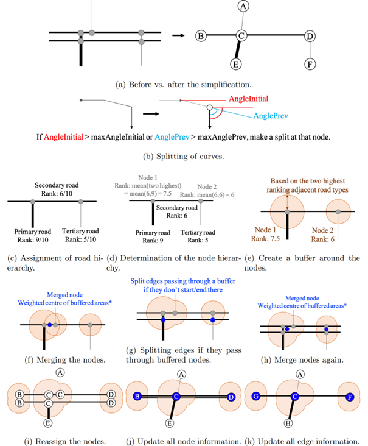
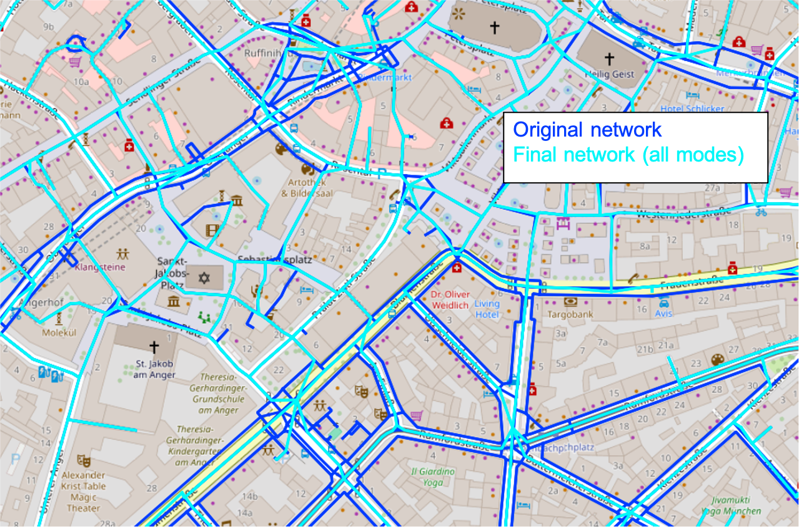
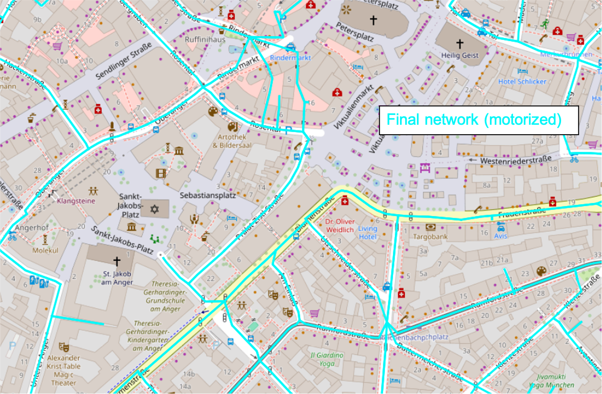
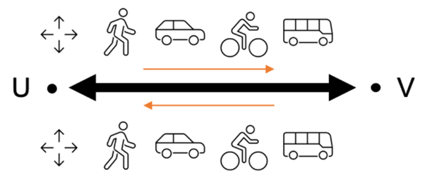

# Summary

The [`OSMNetFusion`](https://github.com/VictoriaDhmn/OSMNetFusion) package is a tool designed to topologically simplify and enrich OpenStreetMap (OSM) networks to facilitate their use for further mobility or geospatial analyses. It provides researchers, transport analysts and urban planners with a simplified, information-rich, multimodal network that retains essential information for various transport applications. With only the location of interest as required input, this tool reduces network complexity by merging edges (roads) and nodes (intersections) and preserves essential tag information, while also adding additional open-source data. Additionally, the resulting network supports the effortless selection of transport-mode-specific subnetworks (e.g., walking, cycling, motorised), making them easier to analyse and visualise.

# Statement of need

`OSMNetFusion` offers a powerful approach to creating a streamlined yet information-rich network, which is multimodal, versatile, and well-suited for spatial network analyses, transportation planning, and mobility services. By merging different types of OSM data with external geographic data and then simplifying the network topology with reduced loss of attribute-information, this framework enables efficient, transport-mode-specific analyses. For instance, `OSMNetFusion`'s network simplification and high information density has already been used for assessing route choice of cyclists, which is affected by many variables [@Dahmen:2025]. Similarly, perceived stress levels have also been studied [@Takayasu:2024]. Furthermore, it could aid mobility service providers to strategically place stations by mapping accessibility based on factors like bike racks and elevation. 

This Python package can simply be cloned, built, and then imported. The config file contains key parameters that can be set as desired, and a wide range of additional parameters that can be altered, e.g., to change the degree of simplification. This package leverages parallel programming to reduce runtime (if supported by the local machine). 

Several existing open-source tools address network simplification for various use-cases in geospatial and mobility analysis. For instance, Fleischmann and Vybornova focus on topological network simplification in a mathematically rigorous manner [@Fleischmann:2024] and recently published [`neatnet`](https://github.com/uscuni/neatnet) [@Fleischmann:2025]. Tools such as [`OSMnx`](https://github.com/gboeing/osmnx) [@Boeing:2024] also offer simplification capabilities to an extent, yet tag-information is lost. Ballo and Axhausen developed a road space reallocation tool [@Ballo:2024b], [`SNMan`](https://github.com/lukasballo/snman), which includes a topological network simplification with a reconstruction and visualisation of the lanes per link [@Ballo:2024a]. `OSMNetFusion` specifically aims to simplify multimodal networks (pedestrian, cyclist, motorised traffic) while retaining OSM tag information and integrating additional open-source data, an aspect typically absent in current solutions but crucial for comprehensive mobility analyses.

# Methodology

The framework is composed of three key steps: data retrieval, network enrichment, and network simplification. 

## Data retrieval

OSM networks contain a wide range of metadata tags covering information from road surface to speed limits and lighting conditions. The OSM platform also contains many items other than the road network, such as information about land-use, public transit, restaurants and mobility-related infrastructure. Additionally, there also exists other relevant open-source data. Hence, data is gathered from all three categories. 

## Network enrichment

All the downloaded data is added to the OSM network to create an enriched, detailed network that captures more than just the road layout. This multi-layered network provides the foundation for the last step, where the network is topologically simplified (consolidated) to produce a model that supports various modes of transport and retains essential topographic and infrastructure characteristics. 

## Network simplification

The topological simplification (and subsequent merging) consists of 8 key steps. The process is visualised in Fig. \autoref{fig:simplSteps}. An example of the topological simplification is shown in Fig. \autoref{fig:example1} and \autoref{fig:example2}.

{width=80%}

{width=60%}

{width=60%}

## Information Preservation and Tag Restructuring

It is no trivial task to merge nodes or edges which have a wide range of information associated to them. Hence, the structure visualised in Figure \autoref{fig:attrStructure} was conceptualised. For each consolidated edge, there are sets of attributes that are each associated with a specific mode (bike, walk, PT, car) and a set of general/high-level attributes (like the object ID). Additionally, four tags denote the accessibility of an edge to the key modes of transport, ensuring the easy selection of mode-specific subnetworks. For a given link, each edge is directional, so if the link is bidirectional (i.e., not one-way for all modes that may access the link), \textit{Edge UV} and \textit{Edge VU} are separate entities. Each edge object retains metadata relevant to its allowed modes of travel. The object-oriented approach reflects this design. Each link object has one or two edges, which in turn may have walking, cycling, and motorized path objects.

{width=35%}

The consolidation process of the node/edge attributes (including the geometries) is explained in depth in the documentation. The result is a compact, well-organised network that is both efficient for computational tasks, accurate and information-rich for practical applications.

# Acknowledgements

Victoria Dahmen acknowledges funding by the TUM Georg Nemetschek Institute Artificial Intelligence for the Built World, and support from Margarita Piscenco on refactoring parts of the code. 
The author confirms that there are no potential conflicts of interest related to this research. 

# References